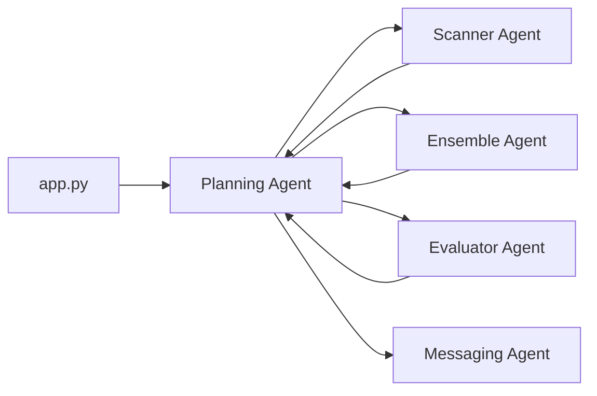

# 🤖 Autonomous Multi-Agent System for Intelligent Deal Discovery
> **A "Council of Experts" for E-commerce Deal Discovery**


A sophisticated **Price Intelligence System** that autonomously discovers exceptional deals on e-commerce platforms using a multi-agent AI architecture. Instead of relying on a single model, this system employs a "Council of Experts" approach where specialized agents collaborate to determine fair market value.

## 🎯 Key Features

- **Multi-Agent Architecture**: Specialized AI agents work collaboratively for accurate price predictions
- **Hybrid Intelligence**: Combines LLMs (Llama 3.1, Gemini) with ML models (LightGBM, Random Forest)
- **RAG-Enhanced**: Uses Retrieval-Augmented Generation with FAISS for historical price grounding
- **Autonomous Discovery**: Continuously monitors RSS feeds for new deals
- **Real-time Alerts**: Instant notifications via Telegram when great deals are found

## 🏗️ System Architecture

### Agent Ecosystem

```
┌─────────────────────────────────────────────────────────┐
│                    Planning Agent                       │
│              (Central Orchestrator)                     │
└──────────────┬──────────────────────────────────────────┘
               │
    ┌──────────┼──────────┬──────────┬
    ▼          ▼          ▼          ▼          
┌────────┐ ┌────────┐ ┌────────-┐ ┌────────-┐ 
│Scanner │ │Ensemble│ │Evaluator│ │Messaging|
│ Agent  │ │ Agent  │ │  Agent  │ │  Agent  |
└────────┘ └──-─--┬─┘ └────────-┘ └────────-┘ 
                  │
       ┌────--─-──┼─────────┐
       ▼          ▼         ▼
   ┌────────--┐ ┌────-┐  ┌──-----──┐
   │Specialist│ │LGBM │  |Frontier │
   │  Agent   │ │Agent│  | Agent   │
   └───────--─┘ └───-─┘  └──────-──┘
```

### Council of Experts

| Expert | Technology | Role |
|--------|-----------|------|
| **Specialist Agent** | Fine-tuned Llama 3.1 8B | Analyzes complex product specifications |
| **Frontier Agent** | Google Gemini 2.5 | Provides second opinion and logic checks |
| **LightGBM Agent** | LightGBM + TF-IDF | Fast keyword-based price estimates |
| **Random Forest Agent** | Random Forest + E5 Embeddings | Semantic similarity-based predictions |
| **Ensemble Agent** | XGBoost Meta-Learner | Aggregates all predictions into final price |

## 📁 Project Structure

```
.
├── app.py                          # Main entry point
├── src/
│   ├── agents/
│   │   ├── base_agent.py          # Base class for all agents
│   │   ├── planning_agent.py      # Central orchestrator
│   │   ├── scanner_agent.py       # RSS feed monitor
│   │   ├── specialist_agent.py    # Llama 3.1 wrapper
│   │   ├── frontier_agent.py      # Gemini 2.5 wrapper
│   │   ├── lightgbm_agent.py      # LightGBM wrapper
│   │   ├── rf_agent.py            # Random Forest wrapper
│   │   ├── ensemble_agent.py      # XGBoost ensemble wrapper
│   |   |── deals.py               # Data structures
│   │   ├── evaluator_agent.py     # Quality assurance
│   │   ├── messaging_agent.py     # Communication handler
│   │   └── rag_utility.py         # Vector search utility
│   ├── prompts.py                 # Centralized prompts
│   ├── dataset_setup.ipynb        # EDA and visualization
│   ├── finetune_dataset.py        # Data cleaning
│   ├── create_jsonl.py            # JSONL formatting
│   ├── collator.py                # Custom tokenization
│   └── merge_llama_qlora.py       # LoRA merging utility
├── rag/
│   ├── install.sh                 # Dependency setup
│   └── build_faiss_index.py       # FAISS index builder
├── notebooks/
│   ├── train_qlora.py             # Llama fine-tuning
│   ├── train_lgbm.py              # LightGBM training
│   ├── train_rf.py                # Random Forest training
│   └── train_ensamble.py          # XGBoost training
└── inference/
    ├── generate_ensamble_data.py  # Meta-learner dataset
    ├── llama_infer_merged.py      # Llama testing
    └── query_with_gemini.py       # RAG testing
```

## 🚀 Installation & Setup

### Prerequisites

- Python 3.10+
- NVIDIA GPU (A100/A6000 for training, smaller GPUs for inference)
- HuggingFace API token
- Google Gemini API key

### Step 1: Install Dependencies

The system includes an automated setup script for RAG GPU libraries:

```bash
bash rag/install.sh
```

This handles:
- GPU-optimized FAISS installation
- PyTorch with CUDA support
- All Python dependencies

### Step 2: Configure Environment

Create a `.env` file in the root directory:

```env
HUGGINGFACE_HUB_TOKEN=your_hf_token_here
GEMINI_API_KEY=your_gemini_key_here
```

### Step 3: Build RAG Index

Encode the training dataset and build the FAISS index:

```bash
python rag/build_faiss_index.py
```

## 🎮 Usage

### Start the Autonomous System

Launch the main application to begin autonomous deal discovery:

```bash
python app.py
```

The system will:
1. Monitor RSS feeds for new products
2. Predict fair market prices using the agent council
3. Evaluate deals and identify exceptional values
4. Send real-time alerts for great deals

### Start the vLLM Server

For optimized Llama inference, run the vLLM server:

```bash
vllm serve src/models/specialist_llama --served-model-name specialist_llama
```

## 🔄 Workflow



### Detailed Process Flow

1. **Planning Agent** initiates the workflow and coordinates all agents
2. **Scanner Agent** monitors RSS feeds and filters relevant products using Gemini Flash
3. **Ensemble Agent** orchestrates the Council of Experts:
   - **Specialist Agent** (Llama 3.1) analyzes product specifications
   - **Frontier Agent** (Gemini 2.5) provides validation and second opinion
   - **LightGBM Agent** generates keyword-based price estimate
   - **XGBoost** aggregates all predictions into final consensus price
4. **Evaluator Agent** compares predicted price vs. actual price
5. **Messaging Agent** sends alerts for verified great deals

## 🧪 Training Pipeline

### Fine-tune Llama 3.1 with QLoRA

```bash
python notebooks/train_qlora.py
```

Uses 4-bit quantization for efficient training on consumer GPUs.

### Train Statistical Models

```bash
# LightGBM with TF-IDF features
python notebooks/train_lgbm.py

# Random Forest with E5 embeddings
python notebooks/train_rf.py
```

### Train Meta-Learner

```bash
# Generate ensemble training data
python inference/generate_ensamble_data.py

# Train XGBoost judge
python notebooks/train_ensamble.py
```

### Merge LoRA Adapters

```bash
python src/merge_llama_qlora.py
```

Combines trained LoRA adapters with base Llama model for production deployment.

## 🧩 Data Processing

### Prepare Dataset

```bash
# Clean raw data
python src/finetune_dataset.py

# Convert to JSONL format
python src/create_jsonl.py
```

### Exploratory Analysis

Open the Jupyter notebook for visualization:

```bash
jupyter notebook src/dataset_setup.ipynb
```

## 📊 Testing & Validation

### Test Llama Inference

```bash
python inference/llama_infer_merged.py
```

### Test RAG Pipeline

```bash
python inference/query_with_gemini.py
```

## 🛠️ Configuration

All agent prompts and templates are centralized in `src/prompts.py` for easy customization and version control.

## 📈 Performance

The ensemble approach provides:
- **Higher Accuracy**: Multiple models compensate for individual weaknesses
- **Robustness**: Diverse prediction methods reduce overfitting
- **Interpretability**: Individual agent contributions can be analyzed
- **Adaptability**: Easy to add/remove agents without system redesign


## 🙏 Acknowledgments

- **Llama 3.1** by Meta AI
- **Google Gemini** for frontier model capabilities
- **FAISS** by Facebook Research for efficient similarity search
- **vLLM** for optimized LLM serving

---
